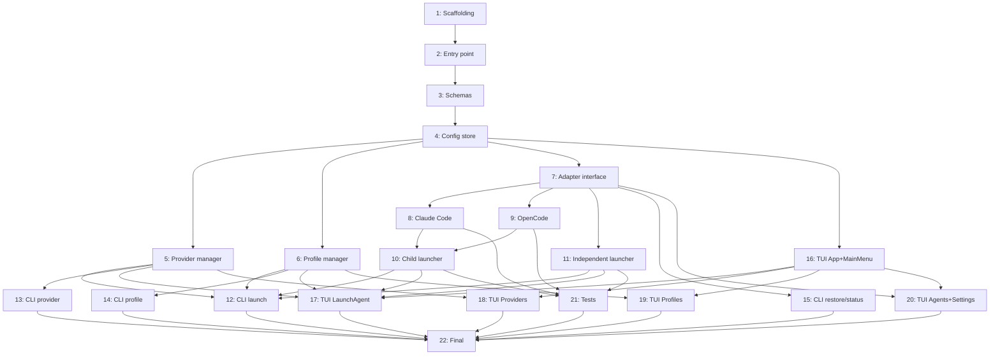

# План реализации: AgentO Core

## Обзор

22 задачи, сгруппированные в 8 блоков. Первые два блока строго последовательны — это фундамент. Далее задачи активно распараллеливаются между субагентами. CLI и TUI разрабатываются параллельно после готовности бизнес-логики.

---

## Задачи

### Блок 1 — Project setup (последовательно)

| # | Задача | Файлы | Зависит от | Режим | Проверка |
|---|--------|-------|------------|-------|----------|
| 1 | Инициализировать npm-пакет: package.json (name, bin, exports, engines), tsconfig.json (strict, ESM), vitest.config.ts, .gitignore, .eslintrc.json, .prettierrc | `package.json`, `tsconfig.json`, `vitest.config.ts`, `.gitignore`, `.eslintrc.json`, `.prettierrc` | — | sequential | `npm install` проходит без ошибок |
| 2 | Точка входа: bin/agento.ts — парсит argv, если есть подкоманда → роутит в CLI, иначе → запускает TUI | `bin/agento.ts` | 1 | sequential | `node bin/agento.ts --help` выводит справку |

### Блок 2 — Config layer (последовательно)

| # | Задача | Файлы | Зависит от | Режим | Проверка |
|---|--------|-------|------------|-------|----------|
| 3 | Zod-схемы: Provider, Profile, ProfileModel, Settings, AgentConfig (базовый тип) | `src/config/schema.ts` | 2 | sequential | `tsc --noEmit` без ошибок |
| 4 | Config store: чтение/запись `~/.agento/config.json`, создание директории при первом запуске, backup-механизм (read/write/restore для `~/.agento/backups/<agent>/<scope>.bak.json`) | `src/config/store.ts` | 3 | sequential | unit test: write → read возвращает то же значение; backup → restore восстанавливает файл |

### Блок 3 — Business logic (параллельно после блока 2)

| # | Задача | Файлы | Зависит от | Режим | Проверка |
|---|--------|-------|------------|-------|----------|
| 5 | Provider manager: CRUD операции над providers[] в config.json (add, list, update, remove по id/name) | `src/providers/provider-manager.ts` | 4 | parallel-subagent | unit test: add → list содержит провайдера; remove → list не содержит |
| 6 | Profile manager: CRUD операции над profiles[] в config.json (add, list, update, remove, reorder models) | `src/profiles/profile-manager.ts` | 4 | parallel-subagent | unit test: add → list содержит профиль; remove → list не содержит |

### Блок 4 — Adapter system (сначала интерфейс, затем параллельно)

| # | Задача | Файлы | Зависит от | Режим | Проверка |
|---|--------|-------|------------|-------|----------|
| 7 | Интерфейс AgentAdapter: типы AgentAdapter, AgentConfig, LaunchScope, методы buildConfig / readConfig / writeConfig / configPaths | `src/adapters/base.ts` | 4 | sequential | `tsc --noEmit` без ошибок |
| 8 | Адаптер Claude Code: buildConfig генерирует патч для `~/.claude/settings.json` и `.claude/settings.json`, readConfig / writeConfig работают с обоими scope | `src/adapters/claude-code.ts` | 7 | parallel-subagent | unit test: buildConfig из профиля возвращает корректный объект с apiKey и baseUrl |
| 9 | Адаптер OpenCode: buildConfig генерирует патч для `~/.config/opencode/config.json` и `opencode.json`, readConfig / writeConfig работают с обоими scope | `src/adapters/opencode.ts` | 7 | parallel-subagent | unit test: buildConfig из профиля возвращает корректный объект конфига OpenCode |

### Блок 5 — Launcher (параллельно после адаптеров)

| # | Задача | Файлы | Зависит от | Режим | Проверка |
|---|--------|-------|------------|-------|----------|
| 10 | Child launcher: backup конфига → writeConfig → spawn с stdio:inherit → ждёт exit → restore; регистрирует SIGTERM/SIGINT cleanup-хуки | `src/launcher/child.ts` | 7, 8, 9 | parallel-same | ручная проверка: spawn `echo hello` завершается корректно, конфиг восстанавливается |
| 11 | Independent launcher: backup конфига → writeConfig → spawn detached + stdio:ignore → unref() → возврат | `src/launcher/independent.ts` | 7 | parallel-same | ручная проверка: spawn `sleep 10 &` запускается независимо |

### Блок 6 — CLI commands (параллельно после блоков 3 и 5)

| # | Задача | Файлы | Зависит от | Режим | Проверка |
|---|--------|-------|------------|-------|----------|
| 12 | CLI launch: `agento launch --profile <name> --agent <id> [--mode child\|independent] [--scope global\|project]`; exit 0 при успехе, exit 1 при ошибке | `src/cli/commands/launch.ts` | 5, 6, 10, 11 | parallel-subagent | `agento launch --help` выводит параметры; запуск с валидным профилем не падает |
| 13 | CLI provider: `agento provider list/add/remove`; exit 0/1 | `src/cli/commands/provider.ts` | 5 | parallel-subagent | `agento provider list` выводит список; add/remove меняет config.json |
| 14 | CLI profile: `agento profile list/add/remove`; exit 0/1 | `src/cli/commands/profile.ts` | 6 | parallel-subagent | `agento profile list` выводит список; add/remove меняет config.json |
| 15 | CLI restore + agent status: `agento restore --agent <id> --scope global\|project`, `agento agent status` | `src/cli/commands/restore.ts`, `src/cli/commands/agent.ts` | 4, 7 | parallel-subagent | `agento agent status` выводит состояние конфигов; restore восстанавливает файл или выводит ошибку с exit 1 если бэкапа нет |

### Блок 7 — TUI (последовательно App, затем экраны параллельно)

| # | Задача | Файлы | Зависит от | Режим | Проверка |
|---|--------|-------|------------|-------|----------|
| 16 | TUI App + MainMenu: корневой Ink-компонент, роутинг между экранами, навигация ↑↓/Enter/Esc | `src/tui/App.tsx`, `src/tui/screens/MainMenu.tsx` | 4 | sequential | `agento` без аргументов рендерит главное меню без краша |
| 17 | TUI LaunchAgent: экран выбора профиля → агента → scope/mode → запуск | `src/tui/screens/LaunchAgent.tsx` | 5, 6, 10, 11, 16 | parallel-subagent | ручная проверка: навигация по шагам, запуск агента через TUI |
| 18 | TUI Providers: список провайдеров, форма создания/редактирования (name, type, apiKey masked, baseUrl, models), удаление | `src/tui/screens/Providers.tsx` | 5, 16 | parallel-subagent | ручная проверка: добавить провайдера через TUI, проверить config.json |
| 19 | TUI Profiles: список профилей, форма создания/редактирования (name, список provider/model), up/down для переупорядочивания | `src/tui/screens/Profiles.tsx` | 6, 16 | parallel-subagent | ручная проверка: добавить профиль через TUI, проверить config.json |
| 20 | TUI Agents + Settings: статус конфигов агентов (original/modified), кнопка Restore; экран настроек defaultLaunchMode и defaultConfigScope | `src/tui/screens/Agents.tsx`, `src/tui/screens/Settings.tsx` | 4, 7, 16 | parallel-subagent | ручная проверка: отображается статус; restore через TUI работает |

### Блок 8 — Tests + Final (последовательно)

| # | Задача | Файлы | Зависит от | Режим | Проверка |
|---|--------|-------|------------|-------|----------|
| 21 | Unit-тесты: store (read/write/backup), provider-manager, profile-manager, claude-code adapter, opencode adapter, child/independent launcher (mock spawn) | `src/**/*.test.ts` | 8, 9, 10, 11 | sequential | `vitest run` — все тесты зелёные |
| 22 | Final polish: заполнить package.json (bin, files, main, exports, publishConfig), создать README.md с установкой и примерами команд | `package.json`, `README.md` | все предыдущие | sequential | `npm pack` создаёт архив без лишних файлов |

---

## Стратегия выполнения

**Строгая цепочка (нельзя параллелить):** 1 → 2 → 3 → 4 → 7 → (8 и 9 параллельно) → 10 и 11 (после 8, 9)

**После завершения задачи 11** — максимальный параллелизм:
- Блок 6 (CLI): задачи 12, 13, 14, 15 — параллельно субагентам
- Блок 7 (TUI): сначала задача 16 (App), затем задачи 17, 18, 19, 20 — параллельно субагентам

**Финал:** задача 21 (тесты) после всей бизнес-логики и адаптеров, задача 22 (финал) — последняя.

---

## Ревью после каждого шага

- После каждой задачи — сверка с `plan.md` и `spec.md`: скоуп не расширен, критерии приёмки выполнены.
- Для параллельных задач — проверить что нет конфликтов по файлам (у каждой задачи свой файл).
- Если задачу выполнял субагент — основной агент проверяет результат (типы компилируются, тест проходит) перед переходом к следующему блоку.
- Не начинать блок 7 (TUI) не убедившись что задачи 5, 6, 10, 11 завершены — они нужны всем экранам.
